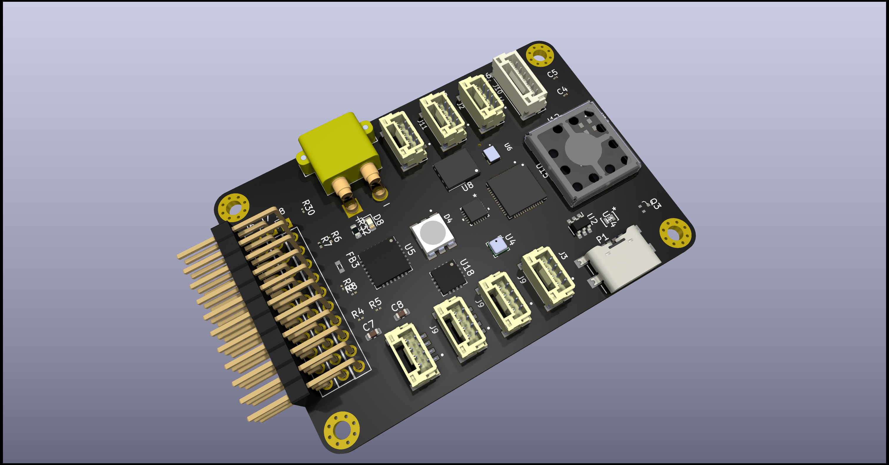

# RP2040 Mikrodenetleyici ile Sabit Kanatlı İHA Projesi




Bu proje, RP2040 mikrodenetleyici kullanılarak geliştirilmiş sabit kanatlı bir İHA'yı hedefler. Proje, özellikle [SimurgFLY] tarafından geliştirilmektedir ve aşağıdaki ana özellikleri içermektedir:
## Kullanilan Malzemler
+ RP2040
+ ICM20948
+ BME280
+ kullanilan malzemelerin devamı eklenecek
## Nasıl Başlanır

Projeyi yerel bilgisayarınıza klonlayın ve aşağıdaki adımları takip ederek projeyi başlatın.

```bash
git clone https://github.com/[kullanıcı-adı]/[proje-adı].git
cd [SimurgFlY]
make init
make build
make run
```
